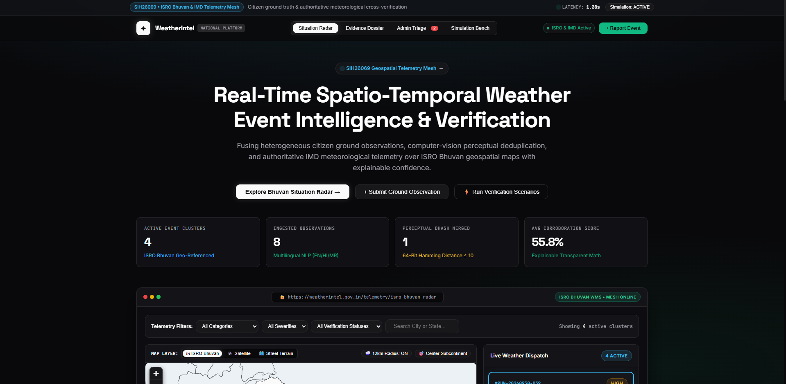

<div align="center">

# 🌦️ WeatherIntel

### National Weather Event Intelligence & Verification Platform

**Smart India Hackathon (SIH26069) Prototype**

[](https://python.org)
[](https://fastapi.tiangolo.com)
[](https://bhuvan.nrsc.gov.in)
[](https://mausam.imd.gov.in)
[](https://leafletjs.com)
[](https://vercel.com)
[](#-privacy--governance-dpdp-act-2023)
[](LICENSE)

<br/>



<br/>
<br/>

**Transforming chaotic citizen ground observations, viral social media photos, and authoritative IMD meteorological telemetry into structured, geospatially clustered weather incidents with mathematically explainable confidence.**

[Explore Situation Radar](#-key-features) • [5-Stage Architecture](#-5-stage-verification-pipeline) • [Local Setup](#-getting-started-locally) • [Vercel Deployment](#-deployment-to-vercel)

</div>

---

## 📌 Problem Context (SIH26069)

During extreme weather events (monsoon cloudbursts, urban flash floods, cyclones, and heatwaves), disaster management agencies face two critical bottlenecks:

1. **Information Fragmentation & Noise**: Citizen ground reports on social media are unstructured, multilingual, and inundated with viral re-uploaded photos from past years.
2. **Lack of Explainable Ground Verification**: Official radar and satellite models often lack micro-local validation, while naive automated filters either block genuine distress signals or trigger panic from false alarms.

**WeatherIntel solves this through an end-to-end verification mesh** that fuses heterogeneous crowdsourced ground truth with authoritative India Meteorological Department (IMD) Automated Weather Stations (AWS) over ISRO Bhuvan geospatial WMS mapping.

---

## ⚡ 5-Stage Verification Pipeline

```text
RAW INGESTION (Citizen Ground Truth + IMD AWS Sensors)
                           ↓
Stage 1: MULTILINGUAL NLP UNDERSTANDING (EN / HI / MR)
         ↳ Extracts weather intent, severity, city, landmark, coordinates
                           ↓
Stage 2: PERCEPTUAL 64-BIT dHASH DEDUPLICATION
         ↳ Detects viral duplicate images using Hamming Distance ≤ 10
                           ↓
Stage 3: SPATIO-TEMPORAL CLUSTERING (DBSCAN 12km Radius)
         ↳ Aggregates independent reports into unified incident clusters
                           ↓
Stage 4: AUTHORITATIVE IMD AWS CORRELATION
         ↳ Cross-references precipitation rate, wind squalls, and barometric pressure
                           ↓
Stage 5: EXPLAINABLE CONFIDENCE SCORING & AUDIT TRAIL
         ↳ Transparent mathematical breakdown (+/- points) with human signoff
```

---

## 🌟 Key Features

### 1. 🇮🇳 ISRO Bhuvan Geospatial Situation Radar

- Integrates official **ISRO Bhuvan / National Remote Sensing Centre (NRSC)** OpenGIS Web Map Service (WMS) layers.
- Real-time interactive radar displaying active weather event clusters, pulsing severity rings, and 12km DBSCAN radius envelopes.
- High-res satellite and street terrain base layers with zero-flicker state diffing.

### 2. 📊 Transparent Forensic Evidence Dossier

- Every confidence score is backed by an **auditable mathematical formula**:
  - `+25 pts`: Official IMD Automated Weather Station validates precipitation threshold.
  - `+15 pts`: Multiple independent citizen observations within 5km radius.
  - `+10 pts`: Ground truth photographic evidence attached.
  - `-15 pts`: Severe discrepancy with nearest IMD sensor (contradiction flag).
- Full audit history detailing each contributing citizen report and station distance.

### 3. 🖼️ Perceptual 64-Bit dHash Image Deduplication

- Computes perceptual difference hash gradients on uploaded photographs.
- Merges viral recycled photos (`Hamming Distance ≤ 10`) under existing clusters without falsely inflating emergency severity counts while preserving each citizen's unique text observation.

### 4. 🛡️ Human-in-the-Loop Admin Triage

- Dedicated emergency officer triage portal to review contradictory or flagged events.
- Commit official verification transitions (`VERIFIED`, `HIGH CONFIDENCE`, `UNDER HUMAN REVIEW`, `REJECTED`) into the immutable audit registry.

### 5. ⚡ One-Click Simulation Bench

- Pre-configured emergency scenario injectors for testing and evaluations:
  - **Pune Monsoon Cloudburst**: Multilingual Marathi/English reports verified by Shivajinagar AWS (78.2 mm/h) $\rightarrow$ Confidence >90%.
  - **Mumbai Floods Viral Image Storm**: Demonstrates 64-bit dHash deduplication collapsing duplicate flood photos across Dadar & Hindmata.
  - **Delhi False Alarm Anomaly**: Exaggerated storm claim contradicted by Safdarjung AWS (0.0 mm/h) $\rightarrow$ Automatic penalty and triage flag.

### 6. 📱 DPDP Act 2023 Compliant Citizen Reporting

- Citizen dialog with full multilingual support (**English, हिन्दी, मराठी**).
- One-touch GPS geolocation lock and photographic ground truth upload.
- Strict data minimization: optional anonymous submission with explicit telemetry consent under the Digital Personal Data Protection Act 2023.

---

## 🛠️ Complete Tech Stack

| Layer                           | Technologies                                                                                               |
| ------------------------------- | ---------------------------------------------------------------------------------------------------------- |
| **Frontend UI**                 | HTML5, Vanilla JavaScript (ES2022), CSS3 Glassmorphism (Shadcn Mainline Aesthetic), Leaflet.js 1.9.4       |
| **Backend API**                 | Python 3.10+, FastAPI, Uvicorn (ASGI), Pydantic v2                                                         |
| **Geospatial & Remote Sensing** | ISRO Bhuvan (NRSC WMS / OpenGIS), IMD AWS & ARG Telemetry Mesh                                             |
| **AI & Computer Vision**        | Multilingual Rule-based Gazetteer NLP, Perceptual 64-bit dHash (Pillow), DBSCAN Spatio-temporal Clustering |
| **Cloud & Database**            | Google Firebase Firestore, Google Cloud Storage, Vercel Serverless Python                                  |

---

## 📂 Project Directory Structure

```text
Cloud_GPT/
├── api/
│   └── index.py               # Vercel Serverless ASGI Python entrypoint
├── backend/
│   ├── main.py                # FastAPI server, endpoints, and static mount
│   ├── requirements.txt       # Backend dependency manifest
│   ├── test_pipeline.py       # Automated verification pipeline tests
│   ├── models/
│   │   └── schemas.py         # Pydantic v2 domain schemas (Event, Report, IMD)
│   └── services/
│       ├── ai_classifier.py   # Multilingual NLP understanding & gazetteer
│       ├── deduplication_service.py # 64-bit dHash image deduplication
│       ├── clustering_service.py    # 12km DBSCAN spatio-temporal clusterer
│       ├── confidence_engine.py     # Explainable mathematical scoring formula
│       ├── imd_service.py           # IMD AWS / ARG telemetry ingestion
│       ├── simulation_service.py    # Scenario injection test suite
│       └── firebase_service.py      # Firestore & Cloud Storage integration
├── frontend/
│   ├── index.html             # Platform shell with Leaflet & typography
│   ├── style.css              # Mainline Next.js aesthetic design tokens
│   ├── app.js                 # Situation radar, dossier, state diffing & fallback
│   ├── build.js               # Zero-dependency production asset packager
│   ├── package.json           # Node configuration and build script
│   ├── public/                # Static asset distribution directory
│   └── dist/                  # Production build output
├── vercel.json                # Vercel serverless routing & asset rewrites
├── requirements.txt           # Root dependency manifest for Vercel Python runtime
├── image.png        # Official high-resolution tech stack banner
└── README.md                  # Project documentation & SIH26069 guide
```

---

## 🚀 Getting Started Locally

### Prerequisites

- **Python 3.10+**
- **pip** and **PowerShell** / **Bash**

### 1. Clone the Repository

```bash
git clone https://github.com/your-username/weatherintel.git
cd weatherintel
```

### 2. Set Up Virtual Environment & Dependencies

```powershell
# Windows PowerShell
python -m venv backend\.venv
.\backend\.venv\Scripts\Activate.ps1
pip install -r requirements.txt
```

```bash
# macOS / Linux
python3 -m venv backend/.venv
source backend/.venv/bin/activate
pip install -r requirements.txt
```

### 3. Launch the Local Server

```bash
python -m uvicorn backend.main:app --reload --port 8000
```

### 4. Open in Your Browser

Navigate to:
👉 **[http://127.0.0.1:8000](http://127.0.0.1:8000)**

---

## ☁️ Deployment to Vercel

The platform is pre-configured with `vercel.json` and `api/index.py` for full-stack deployment on **Vercel Serverless**:

1. Push your repository to GitHub:
   ```bash
   git add .
   git commit -m "Deploy WeatherIntel to Vercel"
   git push origin main
   ```
2. In the **Vercel Dashboard**:
   - Click **Add New Project** $\rightarrow$ Import your GitHub repository.
   - **Framework Preset**: Leave as _Other_ or _Vite_.
   - **Root Directory**: Leave as `./` (Root).
   - Click **Deploy**.
3. Vercel automatically launches:
   - The Python Serverless API on `/api/*` via `@vercel/python`.
   - The frontend on `/` with zero cold-start fallback data.

---

## 📡 REST API Reference

| Method | Endpoint                        | Description                                                                        |
| ------ | ------------------------------- | ---------------------------------------------------------------------------------- |
| `GET`  | `/api/events`                   | List active weather event clusters with filters (`event_type`, `severity`, `city`) |
| `GET`  | `/api/events/{id}`              | Inspect complete forensic dossier for an event                                     |
| `POST` | `/api/events/{id}/verify`       | Commit human-in-the-loop verification signoff                                      |
| `POST` | `/api/reports`                  | Ingest citizen ground observation with multi-part photo upload                     |
| `GET`  | `/api/metrics`                  | Retrieve national telemetry metrics (confidence, latencies, clusters)              |
| `GET`  | `/api/imd/stations`             | Query active IMD Automated Weather Station readings                                |
| `POST` | `/api/simulate-scenario/{name}` | Inject evaluation scenario (`pune_rain`, `mumbai_flood`, `delhi_anomaly`)          |
| `GET`  | `/api/health`                   | Service health and telemetry mesh operational status                               |

---

## 🔒 Privacy & Governance (DPDP Act 2023)

WeatherIntel adheres to strict data protection standards in accordance with India's **Digital Personal Data Protection Act 2023**:

- **Data Minimization**: Only geospatial coordinates and weather observations are stored. Phone numbers and email addresses are never required.
- **Anonymous Reporting**: Citizens may submit observations completely anonymously.
- **Explicit Consent**: Citizen submission requires explicit consent for disaster relief telemetry usage.
- **Perceptual Privacy**: Duplicate photos are compared via mathematical hash gradients without preserving private image metadata (EXIF).

---

## 👥 Contributors & Acknowledgements

- **Developed for**: Smart India Hackathon (SIH26069)
- **Geospatial Data**: [ISRO Bhuvan / National Remote Sensing Centre (NRSC)](https://bhuvan.nrsc.gov.in)
- **Meteorological Data**: [India Meteorological Department (IMD)](https://mausam.imd.gov.in)

---

<div align="center">
  <sub>Built with ❤️ for public disaster resilience and meteorological ground truth.</sub>
</div>
